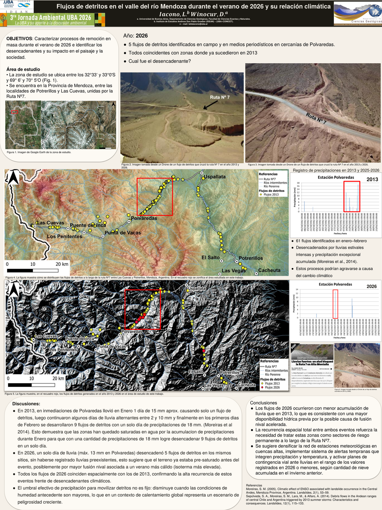
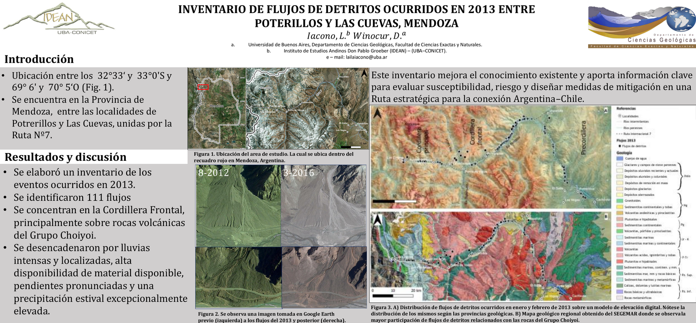

# Laila Iacono — Geological Hazards & Remote Sensing Portfolio

Geoscientist and CONICET PhD researcher specializing in remote sensing and geological-hazard assessment: debris flows, snow avalanches, glacial landform mapping, and GLOF risk. Based in Buenos Aires, Argentina — available for remote collaboration.

📧 lailaiacono@uba.ar &nbsp;|&nbsp; [LinkedIn](https://www.linkedin.com/in/lailaiacono/)

---

## Featured Projects

### 📊 Conference Posters (presented — publicly available)

**Debris Flows in the Río Mendoza Valley, Summer 2026** — *3ª Jornada Ambiental UBA, 2026*
Characterized mass-movement processes during the 2026 summer season near Polvaredas, comparing 2026 debris-flow events to the well-documented 2013 events at the same sites. Combined drone imagery, precipitation records, and spatial recurrence analysis to link triggering thresholds to antecedent soil moisture and snowmelt.

[Full-resolution PDF](poster_2026_debris_flows.pdf)

---

**Inventory of Debris Flows Occurred in 2013 Between Potrerillos and Las Cuevas, Mendoza** — *Encuentro IDEAN*
Built an inventory of 111 debris-flow events along the National Route 7 corridor, mapped against regional geology and terrain models. Found flows concentrated in the Cordillera Frontal, primarily on volcanic rocks of the Choiyoi Group, triggered by intense localized rainfall on steep, high-availability-of-material slopes.

[Full-resolution PDF](poster_2013_inventory.pdf)

---

### Other Project Work
*(PhD thesis in progress — maps and figures will be added here as each result is published)*

**🏔️ Snow-Avalanche Inventory — Punta de Vacas–Puente del Inca, Central Andes**
First mapped snow-avalanche inventory for this sector of the National Route 7 corridor. Built from multitemporal satellite/drone imagery, 12.5–30 m DEMs, and field validation. Quantified start-zone slope, path length, runout distance, solar exposure, and proximity to exposed infrastructure.

*Tools: QGIS, DEM terrain derivatives, AI-assisted Python/QGIS workflows*

<!--  -->

**🌊 Debris-Flow & Susceptibility Mapping — Upper Mendoza River Basin**
End-to-end GIS/remote-sensing workflow combining satellite and drone imagery, terrain derivatives, historical records, and climate data to model debris-flow susceptibility along the Potrerillos–Las Cuevas corridor.

<!--  -->

**🧊 Glacial Landform Reconstruction with Q-GLARE**
Mapped 50+ glacial landforms and applied Q-GLARE (QGIS plugin) with moraine elevation data and Schmidt hammer relative-age measurements to reconstruct glacier extents at approximately 40, 20, and 11 ka.

**🗺️ Interactive Public-Safety Map**
Designed an interactive map identifying safer locations during intense-rainfall and debris-flow events, built for non-specialist/public use.

<!-- [View the interactive map](#) -->

**🌋 Antarctic Peninsula — Magnetic Fabrics Research**
*Milanese, F.N., Iacono, L., et al. (2026). Studia Geophysica et Geodaetica, 70, 9.*

New Anisotropy of Magnetic Susceptibility (AMS) data from Mid-to-Late Jurassic pyroclastic units in the northern Antarctic Peninsula, used to reconstruct volcanic paleoflow directions and provenance for the Kenney Glacier Formation. Results reveal a systematic shift in source area over time, refining tectonic models for the Jurassic Chon Aike Province during Gondwana breakup. Based on three months of fieldwork at Hope Bay (Dec 2021–Mar 2022): lithologic/structural characterization, compass and magnetic-susceptibility measurements, and sample collection for AMS/petrofabric analysis.

[Read the paper (DOI: 10.1007/s11200-026-00015-8)](https://doi.org/10.1007/s11200-026-00015-8) — *published version behind a Springer paywall; full text available via institutional access.*

---

## Technical Skills

**GIS & Cartography:** QGIS (10 yrs) · ArcGIS Pro · Google Earth Pro · spatial databases · georeferencing/reprojection
**Remote Sensing & EO:** Sentinel-1/2 · Landsat 5–9 · ASTER · ALOS-PALSAR · ENVI · classification · change detection
**Terrain & Hazards:** DEM analysis · watershed modeling · geomorphological & susceptibility mapping
**Programming:** AI-assisted Python/QGIS workflows (execution & output validation) · Excel

## Publications

- Milanese, F.N., Iacono, L., et al. (2026). Magnetic fabrics and provenance directions of Mid-Late Jurassic pyroclastic flows from the Northern Antarctic Peninsula. *Studia Geophysica et Geodaetica*, 70, 9.
- Iacono, L. & Winocur, D. (2026). Debris flows in the Río Mendoza valley during the 2026 summer season and their relationship to climatic conditions. Tercera Jornada Ambiental, UBA.
- Iacono, L. & Winocur, D. (2025). Inventory of debris flows that occurred in 2013 between Potrerillos and Las Cuevas, Mendoza. Encuentro IDEAN.

---
📄 [Full CV](#) <!-- link to a hosted PDF/docx if you want -->
